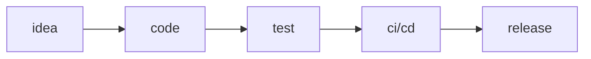

# Hi there 👋 I'm Toffasul

I build reliable web services, developer tools, and small automation utilities. I focus on performance, simplicity, and excellent developer experience.

- 🔧 Focus: backend systems, CLIs, automation
- 🧭 Exploring: Rust, systems programming, resilient architectures
- ✅ Workflow: design → implement → test → deploy

Skills: TypeScript · Node.js · Python · Go · Docker · PostgreSQL · GitHub Actions

Contribute: open an issue or PR on any repo — I review and merge practical fixes.

  

